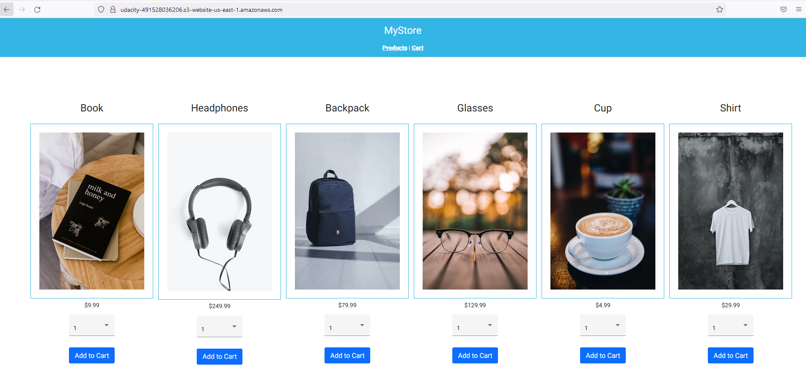

# Storefront app
This project contain example of store where users can login, make order and buy some products from store.

## Project overview

This project is example of Store that contains following components:

- Frontend
- Backend
- Postgres Database

Web App looks following in browser:

Link to deployed Frontend: <http://udacity-491528036206.s3-website-us-east-1.amazonaws.com/>

Link to deployed Backend: <http://udacity-491528036206.s3-website-us-east-1.amazonaws.com/>

Check also [Application dependencies](./docs/Application_dependencies.md#application-dependencies) section.

## Development

To get started, clone this repo and run `npm run backend:install` for backend and `npm run frontend:install` for frontend in your terminal at the project root.

### Build

Run `npm run backend:build` to build the  backend project. The build artifacts will be stored in the `./StorefrontBackend/build/` directory.

Run `npm run frontend:build` to build the  frontend project. The build artifacts will be stored in the `./StorefrontFrontend/dist/` directory.

### Running unit tests

- Deploy [AWS RDS database](./docs/Infrastructure_description.md#AWS-RDS)

- Run `npm run backend:test` to execute backend  unit tests via [Jasmine](https://jasmine.github.io/).

- Run `npm run frontend:test` to execute frontend the unit tests via [Karma](https://karma-runner.github.io).

### How to deploy DEV App

To deploy DEV app do following:

- Deploy and setup [infrastructure](./docs/Infrastructure_description.md#infrastructure-description)
- Configure [circle-ci](./docs/Pipeline_description.md#pipeline-description)
- Run `npm run backend:deploy` to deploy backend inside AWS Elastic Beanstalk.
- Run `npm run frontend:deploy` to deploy frontend inside S3 bucket

## Continuous integration and continuous deployment

To setup CI/CI do following:

- Deploy and setup [infrastructure](./docs/Infrastructure_description.md#infrastructure-description)
- Configure [circle-ci](./docs/Pipeline_description.md#pipeline-description)
- Any new code pushed inside repo will be processed by Circle CI

## Built With

- [Angular](https://angular.io/) - Single Page Application Framework
- [Node](https://nodejs.org) - Javascript Runtime
- [Express](https://expressjs.com/) - Javascript API Framework

## License

[License](LICENSE.txt)